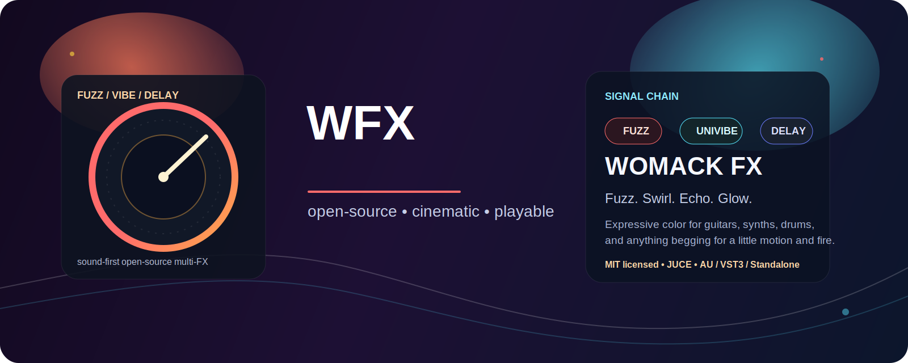
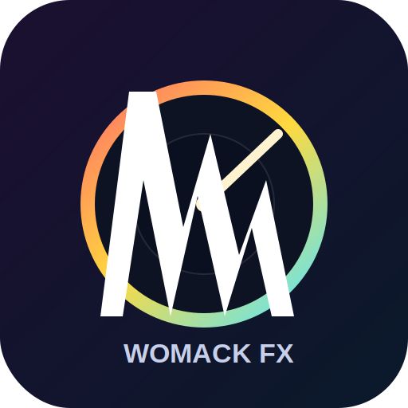
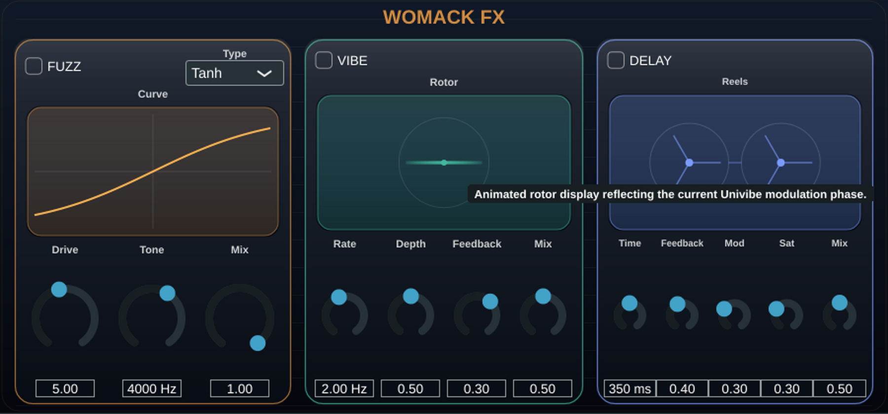

# Womack FX

<p align="center">
  
</p>

<p align="center">
  
</p>

<p align="center">
  <strong>🔥 A vivid, tape-soaked open-source multi-effect plugin built with JUCE.</strong>
</p>

<p align="center">
  Fuzz. Swirl. Echo. Glow.<br/>
  <em>One signal chain. Three expressive effects. Maximum character.</em>
</p>

<p align="center">
  
  
  
  
  
</p>

---

## What is Womack FX?

**Womack FX** is an open-source multi-effect plugin that fuses three character-rich processors into one playable signal path:

- **Fuzz** for grit, compression, and harmonic attitude
- **Univibe-style modulation** for movement, wobble, and psychedelic shimmer
- **Tape delay** for space, warmth, wow/flutter, and repeat decay

The result is a compact, expressive plugin that feels like a small pedalboard with a cinematic streak.

It is built in public, designed to sound alive, and structured to be as interesting to explore in code as it is to use in a session.

## At a glance

- **Name:** Womack FX
- **Type:** open-source audio multi-effect plugin
- **Formats:** AU, VST3, Standalone
- **Platform today:** macOS
- **Core chain:** `Fuzz → Univibe → Tape Delay`
- **Sound:** psychedelic, saturated, animated, performance-friendly

## UI preview

<p align="center">
  
</p>

<p align="center">
  <em>The current Womack FX interface: three animated effect sections, colorful visualizers, and clearly labeled controls built for real use.</em>
</p>

## Why it stands out

Womack FX is not trying to be a sterile utility plugin.

It is aiming for **feel**.

- A **multi-stage signal chain**: `Fuzz → Univibe → Tape Delay`
- A **custom JUCE UI** with animated visualizers for each effect section
- A character-first implementation with **oversampling**, **waveshaping**, **phaser motion**, **wow/flutter modulation**, **feedback saturation**, and **damping filters**
- A clean, hackable structure that is approachable for musicians and developers alike

If you like plugins that feel a little alive, a little vintage, and a little dangerous, you are in the right place.

## Feature set

### Fuzz

- Drive control
- Tone control
- Wet/dry mix
- Three clipping modes:
  - `Tanh`
  - `Hard Clip`
  - `Asymmetric`
- Oversampled waveshaping for smoother distortion behavior
- Live transfer-curve visualization

### Univibe

- Rate
- Depth
- Feedback
- Wet/dry mix
- Animated rotor visualization
- Phaser-based modulation for chewy, swirling motion

### Tape Delay

- Delay time
- Feedback
- Modulation amount
- Saturation amount
- Wet/dry mix
- Tape reel visualization
- Wow/flutter-style modulation, saturated repeats, and damped feedback

### General

- Stereo processing
- AU, VST3, and Standalone builds
- State saving/loading through `AudioProcessorValueTreeState`
- MIT licensed

## Sonic architecture

The processing chain is intentionally straightforward and musical:

1. **Fuzz** hits first for harmonic density and bite
2. **Univibe** adds movement and dimension after the dirt
3. **Tape Delay** smears the whole thing into space

That ordering gives Womack FX a performance-friendly feel: you can move from subtle motion to blown-out dream fuzz without leaving the plugin.

## Built with

- **C++20**
- **JUCE 8**
- Custom DSP modules for each effect stage
- A custom plugin editor with animated effect visualizers
- A simple build workflow for real plugin bundles on macOS

## Build the project

### Recommended: use the helper script

From the repository root:

```bash
./build-womackfx.sh all
```

Other options:

```bash
./build-womackfx.sh standalone
./build-womackfx.sh au
./build-womackfx.sh vst3
./build-womackfx.sh configure
```

### Raw CMake commands

Configure:

```bash
cmake -B build -G Xcode
```

Build the actual plugin/app bundles:

```bash
cmake --build build --config Release --target WomackFX_AU WomackFX_VST3 WomackFX_Standalone
```

> **Important:** `WomackFX` by itself is the shared code target.
> To build the products you actually run in a host or as an app, use:
> `WomackFX_AU`, `WomackFX_VST3`, and/or `WomackFX_Standalone`.

## Output locations

After a successful Release build, you can expect:

- **Standalone app**
  - `build/plugins/WomackFX/WomackFX_artefacts/Release/Standalone/Womack FX.app`
- **AU plugin**
  - `~/Library/Audio/Plug-Ins/Components/Womack FX.component`
- **VST3 plugin**
  - `~/Library/Audio/Plug-Ins/VST3/Womack FX.vst3`

Because the build is configured with `COPY_PLUGIN_AFTER_BUILD`, AU and VST3 builds are copied into the standard user plugin folders on macOS after build.

## Project structure

```text
plugins/WomackFX/
├── Source/
│   ├── Effects/       # Fuzz, Univibe, Tape Delay DSP
│   ├── UI/            # Custom panels + animated visualizers
│   ├── PluginEditor.*
│   ├── PluginProcessor.*
│   └── Parameters.h
└── CMakeLists.txt
```

## Roadmap

- [x] Multi-stage signal chain with custom DSP
- [x] Custom animated plugin UI
- [x] Labeled controls for all effect sections
- [x] AU / VST3 / Standalone builds
- [ ] Screenshots and audio demos in the repo
- [ ] Presets / artist patches
- [ ] Tempo-sync options for delay and modulation
- [ ] Expanded effect modes and alternate voicings
- [ ] Automated CI builds

## Current status

Womack FX is already a real, playable plugin—not just a scaffold or a concept.

It currently ships with:

- a working multi-effect audio path
- animated custom UI panels
- labeled controls
- plugin bundle targets for real-world testing on macOS

And because the code is readable and modular, it is also a strong foundation for:

- preset systems
- tempo sync
- expanded modulation
- richer tone shaping
- additional stompbox modules

## Show some love

If Womack FX makes you smile, melt, wobble, or immediately open your DAW, here is the best possible open-source support package:

- **⭐ Star the repo**
- **🍴 Fork it and build your own flavor**
- **📣 Share it** with musicians, DSP nerds, plugin devs, and tone freaks
- **🐛 Open issues** for bugs, ideas, and feature requests
- **🎛️ Post screenshots or clips** if you make something beautiful, strange, or gloriously overdriven with it

## Contributing

Issues, ideas, experiments, and pull requests are welcome.

If you want to contribute, great places to start are:

- sound design refinements
- UI polish and accessibility
- additional effect modes
- build/documentation improvements
- host compatibility testing

If this project sparks something for you, **star the repo**, open an issue, and build something strange and excellent with it.

## License

This project is licensed under the **MIT License**.

See [`LICENSE`](LICENSE).

## Final note

Womack FX is a love letter to expressive audio software: dirty edges, moving light, spinning tape, and code you can actually read.

If you ship music with it, prototype with it, fork it, improve it, or simply enjoy having it on your GitHub profile, then it is doing exactly what it was made to do.